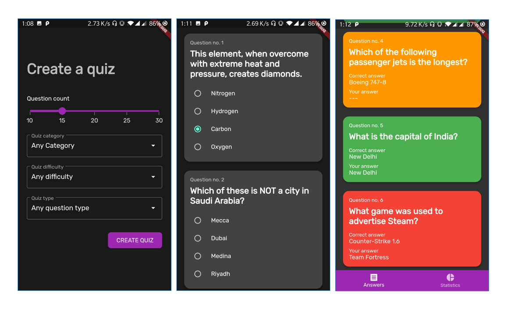

# quizmate_flutter

A simple quiz application that demonstrates the basic usage of Flutter.

## Installation

```
- Clone the repository into your computer 

- Open the root directory of the source with Android Studio
- Run the app in an emulator or a physical device
```

### Topics covered in the project

- UI design with material components
- Application theming (Light/Dark)
- State management (Global/Local)
- Navigation
- API access
- Dart extensions
- State immutability

### Tools and resources

- [Android studio](https://developer.android.com/studio)
- [BLoC and Flutter BLoC](https://bloclibrary.dev/#/)
- [Dio HTTP client](https://pub.dev/packages/dio)
- [Google fonts](https://pub.dev/packages/google_fonts)
- [Syncfusion Flutter widgets](https://github.com/syncfusion/flutter-widgets)

### Screenshots




## Contributing

I'm not accepting contributions at the moment.

However, the repository is marked as a template. So feel to create a copy for yourself and build on
it.

## License

```
Copyright 2021 Sudeera Sandaruwan

Licensed under the Apache License, Version 2.0 (the "License");
you may not use this file except in compliance with the License.
You may obtain a copy of the License at

    http://www.apache.org/licenses/LICENSE-2.0

Unless required by applicable law or agreed to in writing, software
distributed under the License is distributed on an "AS IS" BASIS,
WITHOUT WARRANTIES OR CONDITIONS OF ANY KIND, either express or implied.
See the License for the specific language governing permissions and
limitations under the License.
```
